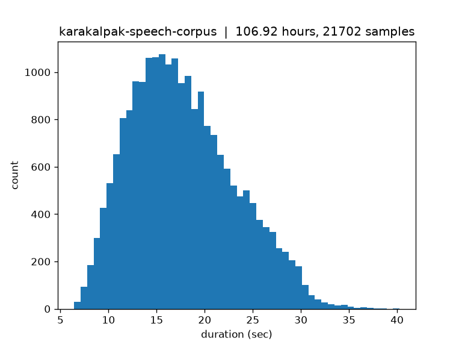
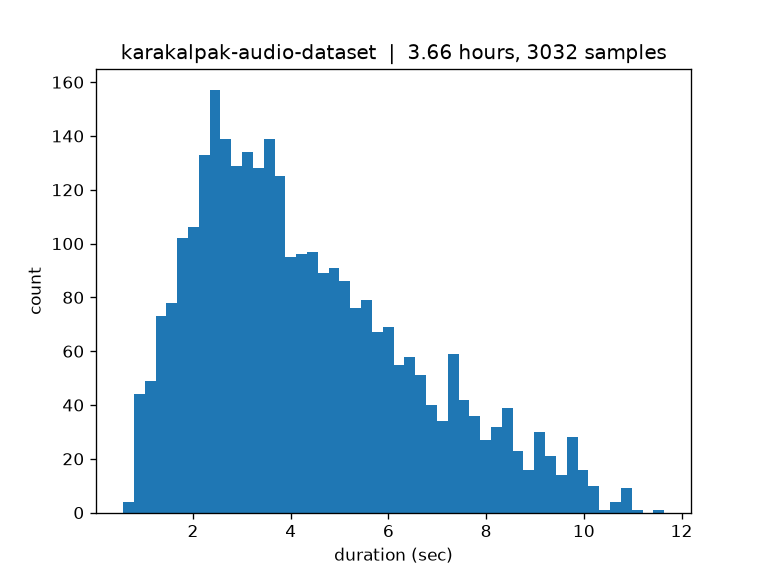
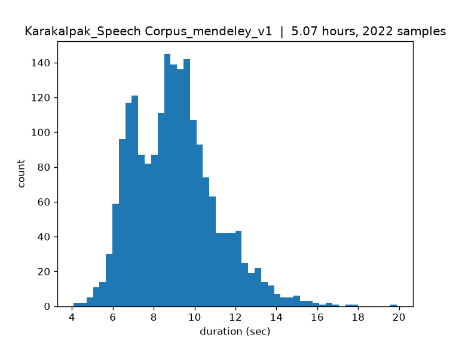

### Data source 1: [Karakalpak Speech Corpus](https://huggingface.co/datasets/atikuwu/karakalpak-speech-corpus)

**Audio stats:**

| Metric      |  Value |
| ----------- | -----: |
| Files       |     10 |
| Samples     | 21,702 |
| Total hours | 106.92 |

**Sample rates:**

| Sample rate (Hz) |  Count |
| ---------------: | -----: |
|           48,000 | 21,702 |

**Duration (sec):**

| Statistic |     Value |
| --------- | --------: |
| Count     | 21,702.00 |
| Mean      |     17.74 |
| Std       |      5.42 |
| Min       |      6.41 |
| 25%       |     13.61 |
| 50%       |     17.09 |
| 75%       |     21.29 |
| Max       |     40.25 |

---

### Data source 2: [Karakalpak Audio Dataset](https://huggingface.co/datasets/kaa-ml/karakalpak-audio-dataset)

**Audio stats:**

| Metric      | Value |
| ----------- | ----: |
| Files       |     4 |
| Samples     | 3,032 |
| Total hours |  3.66 |

**Sample rates:**

| Sample rate (Hz) | Count |
| ---------------: | ----: |
|           44,100 | 3,032 |

**Duration (sec):**

| Statistic |    Value |
| --------- | -------: |
| Count     | 3,032.00 |
| Mean      |     4.34 |
| Std       |     2.24 |
| Min       |     0.57 |
| 25%       |     2.58 |
| 50%       |     3.86 |
| 75%       |     5.75 |
| Max       |    11.64 |

---

### Data source 3: [Karakalpak Speech Corpus — Mendeley Data](https://data.mendeley.com/datasets/2th8jvft8f/1)

**Audio stats:**

| Metric      |                Value |
| ----------- | -------------------: |
| Files       | 2,022 (0 unreadable) |
| Total hours |                 5.07 |

**Sample rates:**

| Sample rate (Hz) | Count |
| ---------------: | ----: |
|           16,000 | 1,508 |
|           32,000 |   500 |
|           44,100 |    14 |

**Channels:**

| Channels | Count |
| -------: | ----: |
|        1 | 1,999 |
|        2 |    23 |

**Duration (sec):**

| Statistic |    Value |
| --------- | -------: |
| Count     | 2,022.00 |
| Mean      |     9.03 |
| Std       |     2.04 |
| Min       |     4.08 |
| 25%       |     7.40 |
| 50%       |     8.92 |
| 75%       |    10.16 |
| Max       |    19.90 |

