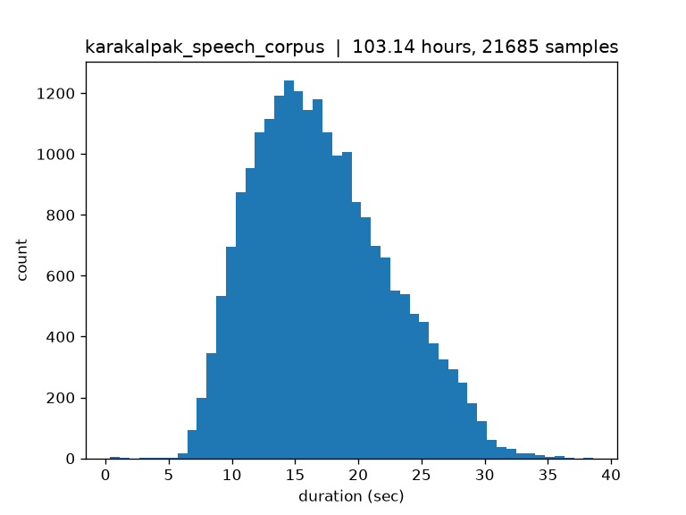

# Audio Stats 
After cleaning audio (resampling ;VAD) 
[Karakalpak Speech Corpus](https://huggingface.co/datasets/atikuwu/karakalpak-speech-corpus)

| Metric | Value |
| --- | ---: |
| Files | 10 |
| Samples | 21,685 |
| Total hours | 103.14 |

## Sample Rates

| Sample rate (Hz) | Count |
| ---: | ---: |
| 16,000 | 21,685 |

## Duration (sec)

| Statistic | Value |
| --- | ---: |
| Count | 21,685.00 |
| Mean | 17.12 |
| Std | 5.37 |
| Min | 0.35 |
| 25% | 13.02 |
| 50% | 16.51 |
| 75% | 20.70 |
| Max | 38.59 |

